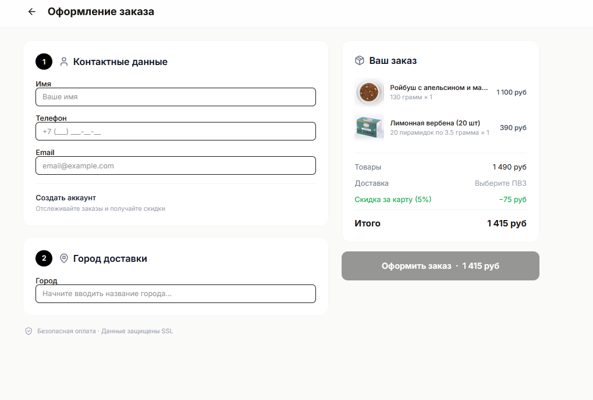

# правки 1

Изучи еще раз C:\Users\oleg\Documents\GitHub\vkus.online.backend\propmpts\flow3\improve-flow3.md

Мне кажется те изменения, которые ты сделал не полностью соответствуют изначальному плану. 

не появляется форма статуса заказа описанная в “**Улучшение flow оформления заказа:”**

после нажатия кнопки “оформить заказ” меня перекидывало на главную страницу, на которой на верху появлялось на пол секнду маленький оверлей “заказ успешно оформлен” и меня сразу перекидывало на окно оплаты на сайте yookassa. после успешной оплаты меня перекидывало обратно на [https://vkus.online/payment/return](https://vkus.online/payment/return) хотя должно перекидывать на сайт [http://localhost:5173/#/orders/Tb9wE4qicn6z0yl1duvUBTYa7TKchz9_6wKN9ZDMLiY](http://localhost:5173/#/orders/Tb9wE4qicn6z0yl1duvUBTYa7TKchz9_6wKN9ZDMLiY) - потому что с него мы сейчас ведем разработку. Более того, возврат должен быть на этот же адрес

проблема с плашкой “создать аккаунт”, она появилась сразу хотя я даже не ввел email:

а по моему тз она должна появляться только когда email заполнен и клиент в базе не существует.

На это плашке должен быть переключатель (по типу выкл\выкл) что клиент хочет создать аккаунт. По умолчанию он включен но клиент может его выключить.