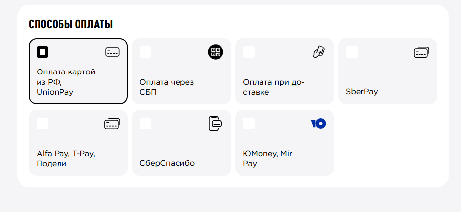
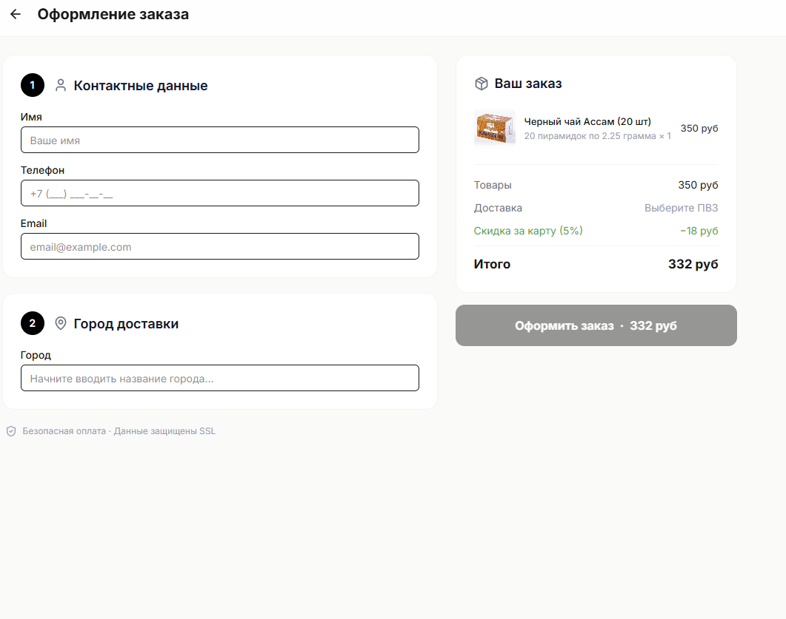
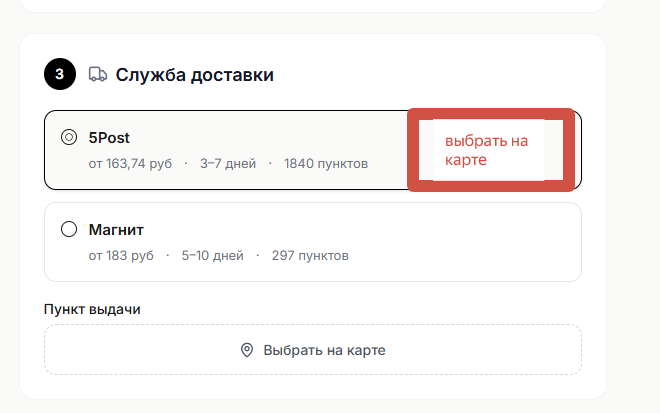

# Правки 4

Яндекс карта с ПВЗ:

Нужна “ленивая загрузка” - Оптимизировать загрузку карты: 

сейчас карта получает 2000 ПВЗ и рисует точки на карты объединяя их в “букеты”. Это ок. 

Но параллельно слева от карты создается список всех ПВЗ, для удобного поиска. Когда ПВЗ очень много - браузер начинает тормозить когда пытается заполнить весь список 2000 элементами. Чтобы это оптимизировать, предлагаю сделать lazy-loading этого списка, и только если пользователь решил сделать поиск - загружать сразу весь. Все равно он болтается в памяти, как я понимаю и бэк тут переписывать не нужно, только фронт. 

Так же добавить фильтр в пункты выдачи, чтобы можно было отфильтровать только ПВЗ которые принимают оплату наложенным платежом.

Добавить границу оформления заказа для бесплатной доставки. Вынести это в настройки в .env

Добавить размер скидки при предоплате на сайте в .env

Изменить логику работы формы оформления заказа:

1. Способ оплаты виден всегда. предпочитаемый вид: картинка #1
    
    
    
    картинка #1
    
    т.е. небольшие плитки с информацией о них. Когда на карте выбран ПВЗ, не допускающий оплату наложенным платежом, то недоступный способ оплаты “Оплата при доставке” сделать не активным и показать что “недоступен в выбранной пункте выдачи”
    
    Способ оплаты оставить на старом месте, но сделать все время видимым, но нужно визуально обозначить что клиенту надо выбрать и что он не выбран
    

 

картинка #2

функционал служб доставки сделать более компактным: переместить элемент управления выбора пункта выдачи внутрь прямоугольника выбора службы доставки, в область справа справа примерно как показано на картинке #3:

картинка #3

Переписать шаблоны писем для админа на более строгий деловой шаблон, с более крупным шрифтом.

Улучшить визуал карты 5post: отличать точки где можно делать оплату о тех в которых нельзя чтобы сделать ее более понятной клиентам, лучше сделать похожим на иноки их оригинального виджета [https://fivepost.ru/widget](https://fivepost.ru/widget). - посмотри как сделано через браузер.

Полный QA через браузер, проверить все варианты оплаты.