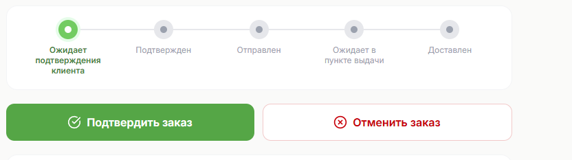

# Правки 6

Изменения в life-cycle заказа сделанного наложенным платежом (CODFLOW).

между PENDING_CONFIRMATION → CONFIRMED добавить новый статус CONFIRMED_BY_CLIENT

Новый life-cycle будет:

```html
PENDING_CONFIRMATION → CONFIRMED_BY_CLIENT → CONFIRMED → SHIPPED → READY_FOR_PICKUP → DELIVERED
```

CONFIRMED_BY_CLIENT (”подтвердите ваш заказ”) нужен чтобы отделить процесс подтверждения клиентом от процесса подтверждения менеджером магазина. В PREPAID-заказах у нас статус CONFIRMED устанавливает магазин, пусть так же будет и с заказами CODFLOW.

Когда клиент подтвердил заказ, должно сработать событие CONFIRMED_BY_CLIENT по которому менеджер магазина получает письмо по шаблону о том что клиент сделал заказ в магазине с оплатой наложенным платежом.

Проанализируй весь проект чтобы понять где необходимо внести изменения и места которых эти изменения в lyfe-cycle могут затронуть. 

Внедрить в бэк, внедрить в адмнику vkus_cli.py, 

сделать QA тесты и QA в браузере. 

внести изменения в документацию.

Фронт:



изменить логику работы панели отображения статуса на фронте. 

Постараться не плодить количество количество “кружков”.  Их сейчас 5. 

Первый кружок: либо ожидание подтверждение от клиента либо что клиент уже подтвердил. 

Второй кружок: статус подтверждения магазином. 

Третий кружок: статус отправки магазином. 

Четвертый кружок: статус в точке выдачи (пвз) - как сейчас. 

Пятый кружок: статус доставки как сейчас, зеленым цветом, либо если клиент не забрал, то кружок красным цветом показать что клиент не забрал заказ.

Шестой кружок: появляется только если 5й кружок принял статус что клиент не забрал посылку, и 6й кружок должен показать что заказ вернулся в поставщику (при установке соответствующего статуса) - синим цветом.

Такую же логий применить для заказов PREPAID.