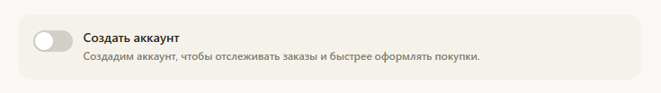

# flow оформления заказа часть 3.

**Уникальная секретная ссылка для каждого заказа:**

Новый механизм для бэка и фронта: Уникальная «секретная» ссылка для каждого заказа, генерируемая бэком. Для ее генерации используй случайный набор букв и цифр, который потом будет использоваться в ссылке, например «gf4387rytfu3i4hf3489y438h34h932u9ye23ghey23gjdshgf», это будет `#UNIQUE_ORDER_ID#` (см. ниже про мета-поля), тогда ссылка будет что то типа `https://[ SERVER_NAME]/orders/gf4387rytfu3i4hf3489y438h34h932u9ye23ghey23gjdshgf`

По этой ссылке клиент подтверждает заказ в случае наложенного платежа, затем по ней же может его просматривать и так же видеть статус выполнения. В случае предоплаты, по этой ссылке клиент так же просматривает свой заказ и статусы доставки\оплаты. Эта система уникальных ссылок нужна для того, чтобы принимать заказы от клиентов без регистрации, но при этом, чтобы эти заказа не терялись мы делаем такую систему. Эти же ссылки будут использоваться сейл-менеджером магазина для просмотра какие заказы сделали клиенты.  Когда клиент пожелает зарегистрироваться, эти заказы будут привязаны к нему в ЛК по email.

! Запретить оформление заказа без оплаты, если выбрана оплата банковской картой.

**Система событий**

Нововведение: система событий. События разбиваются на группы. Идея в том, чтобы когда какое то событие происходит, система должна предпринять какие то действия. Планируется что это рассылка почты. 

Группы событий типа: “изменения статуса заказа”, “регистрация нового клиента”, “сброс пароля”, возможно появятся еще.

Группы события типа “изменения статуса заказа” так же группируются по типам заказов. Пока у нас есть 2 типа заказов: PREPAID и CODFLOW (см ниже про Order Lifecycle). PREPAID и CODFLOW - это отдельные группы событий.

Группа событий типа “изменение статуса заказа” содержит целую группу событий связанных с заказами клиентов. Каждый статус заказа - это отельное событие. 

Группы событий “регистрация нового клиента”, “сброс пароля”  -пока содержат по одному событию и объединяются в одну большую группу OTHERS

К каждому событию привязан собственный почтовый шаблон (см. ниже про почтовые шаблоны).

Предусмотреть появление новых событий.

**Улучшение flow оформления заказа:**

После нажатие кнопки «оформить заказ», оформление заказа переходит на промежуточную форму подтверждения (она же – форма статуса заказа), где будет суммаризирован заказ: кто заказчик, контакты, номер заказа, состав, цена, бонусы, сумма, скидки, форма оплаты, служба доставки, пункт доставки итп. На этой форме отображается пошаговый индикатор этапов (stepper) заказа, принят, отправлен, ожидает в точке выдачи, выдан\отменен\возвращён поставщику(см. ниже про статусы заказов и их человеческие названия).

В случае предоплаты: И кнопка «оплатить и продолжить» : В этом случае должна сработать оплата через yookassa, с callback-ом  обратно в магазин, на форму статуса заказа, где клиенту будет показано что «ваш заказ оплачен», чтобы отслеживать состояние заказа вам на почту клиента отправлена ссылка(см. ниже шаблоны писем).

В случае оплаты наложенным платежом: кнопка «подтвердить заказ»: В этом случае клиенту отправляется email с уникальной ссылкой, кликнув по которой клиент должен подтвердить заказ – перекидывает на сайт где ему сообщается что ваш заказ подтвержден.

Таким образом, письмо с ссылкой подтверждения заказа – эта та же самая уникальная ссылка на заказ, только если на нее клиент перешел первый раз, система должна понять что в случае если этот заказа с наложенным платежом, то он подтверждается. Если же заказ с предоплатой – то он подтверждается в случае удачной 100%-й оплаты (подтверждения от платежной системы).

**Изменение Order Lyfacyle:**

Так же необходимо изменить Order Lifecycle. Так как заказ в случае наложенного платежа и в случае предоплаты должен иметь разный Order Lifecycle. 

Реализуй типы заказов: PREPAID – предоплаченный; CODFLOW - оплата при получении.

Для предоплаченного заказа (PREPAID):

`DRAFT -> PENDING_PAYMENT -> PAID -> CONFIRMED -> SHIPPED -> READY_FOR_PICKUP -> DELIVERED`

`DRAFT -> PENDING_PAYMENT -> CANCELLED (user cancel)`

`DRAFT -> PENDING_PAYMENT -> PAID -> CONFIRMED -> SHIPPED -> READY_FOR_PICKUP -> RETURNED_TO_SUPPLIER`

Для заказа с наложенным платежом (CODFLOW):

`DRAFT -> PENDING_CONFIRMATION -> CONFIRMED -> SHIPPED -> READY_FOR_PICKUP -> DELIVERED`

`DRAFT -> PENDING_CONFIRMATION -> CANCELLED (user cancel)`

`DRAFT -> PENDING_CONFIRMATION -> CONFIRMED -> SHIPPED -> READY_FOR_PICKUP -> CLIENT_DONT_PICKUP -> RETURNED_TO_SUPPLIER`

В .env прописать соответствия между системными названиями статусов заказов(событий) и «человеческим языком»:

`DRAFT:Черновик`

`PENDING_CONFIRMATION: Ожидает подтверждения клиента`

`CONFIRMED: Подтвержден`

`SHIPPED: Отправлен`

`READY_FOR_PICKUP: Ожидает в пункте выдачи`

`CLIENT_DONT_PICKUP: Клиент не забрал посылку`

`RETURNED_TO_SUPPLIER: Возвращен в магазин`

`DELIVERED: Доставлен`

`PENDING_PAYMENT: Ожидает оплаты`

`PAID: Оплачен`

`CLIENTNEW: Регистрация нового клиента`

`CLIENTRESETPASS: Клиент сбрасывает пароль`

`CLIENTREMINDPASS: Клиент просит напомнить ему пароль`

В обеих случаях как клиенту так и на специальную почту (администратору магазина или главному сейлз-менеджеру магазина ) должны отправлять сообщения по следующей системе:

Научить Бэк отправлять почту. 

Почту надо рассылать по происшествии разных событий (см. **Система событий**) согласно почтовому шаблону. К одному событию может быть привязано несколько почтовых шаблонов, примеры:

1. На событие PENDING_CONFIRMATION :
    1. шаблон письма клиенту в случае когда заказ создан на событие PENDING_CONFIRMATION
2. На событие CONFIRMED
    1. Шаблон письма клиенту, что ваш заказ подтвержден
    2. Шаблон письма администратору, что клиент создал заказ
3. На RETURNED_TO_SUPPLIER
    1. Шаблон администратору магазина, что клиент не забрал заказ.

Идея в том что каждый статус заказа - это событие. 

Редактирование шаблонов писем: шаблоны должны быть редактируемы, в них должны быть мета-поля для подстановки, такие как:

`#EMAIL#  - системой подставляется клиентский`

`#ORDER_USER# - имя клиента`

`#PHONE# - телефон клиента`

`#ORDER_ID# - номер заказа клиента`

`#ORDER_DATE# - дата/время заказа`

`#CLIENTREGISTER_DATE# - дата/время регистрации клиента`

`#ORDER_LIST# - состав заказа, товары которые заказал клиент, артикулы, количество, сумма, по товару(SKU) на строчку`

`#SERVER_NAME# - адрес нашего магазина, в нашем случае это vkus.online (прописывается где то в конфигурации в .env)`

`#SHOP_NAME# - название магазина`

`#SALE_EMAIL# - email отдела продаж или администратора магазина, определяется в .env`

`#SYS_SHOP_EMAIL#  -почта от которой магазин отправляет почту, в нашем случае это [shop@coffee-tea.ru](mailto:shop@coffee-tea.ru), определяется в .env`

`#UNIQUE_ORDER_ID# - уникальный идентификатор заказа, который используется для формирования «Уникальной секретной ссылки для каждого заказа»,`

`#PRICE# - Стоимость заказа для клиента`

`#CLIENTPASSWORD# - Клиентский пароль`

Пример почтового шаблона, как может выглядет`ь файл admin_cofirm.template:`

`--- start example --------------`

`@FROM: #SYS_SHOP_EMAIL#`

`@TO: #SALE_EMAIL#`

`@TEXTBODY:`

`Клиент #ORDER_USER#, #EMAIL#`

`Телефон клиента: #PHONE#`

`заказ номер #ORDER_ID# от #ORDER_DATE# принят.`

`Стоимость заказа: #PRICE#.`

`Состав заказа:`

`#ORDER_LIST#`

`Ссылка для просмотра заказа:`

`https://#SERVER_NAME#/orders/#UNIQUE_ORDER_ID#`

`С уважением,`

`администрация Интернет-магазина`

`E-mail: #SALE_EMAIL#`

`--- end example ---------------`

Тут у нас все в одном файле, есть разделы: @FROM: - это поле от кого отправляется почта, @TO: - кому отправляется почта, @TEXTBODY: - это боле письма, которое надо прям вставить в тело письма, заменив мета-поля. Я не уверен что надо делать именно так, так как где то в тексте может случайно попасть сочетание символов используемое для разделения разделов, что приведет к ошибке парсинга. Может быть @FROM, @TO, @TEXTBODY надо переименовать так чтобы совпадений небыло.

Другой пример шаблона письма клиенту что ваш заказ подтвержден client_cofirm.template:

`--- start example --------------`

`@FROM: #SYS_SHOP_EMAIL#`

`@TO: #EMAIL#`

`@TEXTBODY:`

`Уважаемый #ORDER_USER#, благодарим вас за заказ в магазине #SHOP_NAME#`

`Ваш заказ #ORDER_ID# от #ORDER_DATE# подтвержден, отслеживайте статус заказа по ссылке https://#SERVER_NAME#/orders/#UNIQUE_ORDER_ID#`

`Стоимость заказа: #PRICE#.`

`Состав заказа:`

`#ORDER_LIST#`

`С уважением,`

`администрация Интернет-магазина #SHOP_NAME#`

`E-mail: #SALE_EMAIL#`

`--- end example ---------------`

Для удобства администрирования бэка, я бы хотел, чтобы ты реализовал почтовые шаблона в виде файлов в папках:

структура папок: [типа заказа]\[событие]\{Файлы шаблонов, по одному файлу на каждый шаблон}

Примеры:

`файл /CODFLOW/CONFIRMED/admin_cofirm.template – шаблон для оповещения администратора магазина что клиент подтвердил заказ (тогда логист начнет его собирать на складе)`

`файл /CODFLOW/CONFIRMED/client_cofirm.template – шаблон для оповещения клиента что вы подтвердили заказ`

`файл /PREPAID/RETURNED_TO_SUPPLIER/admin_aware.template – шаблон для админа магазина что клиент не забрал заказ и надо срчоно связываться с 5post или magnit чтобы вернуть заказ нам на склад с их склада итп.`

тут у нас `CONFIRMED, RETURNED_TO_SUPPLIER,` итд - это события.

В случай отправки сообщений по событиям регистрации нового пользователя(CLIENTNEW), сброса пароля(CLIENTRESETPASS), напоминания пароля (CLIENTREMINDPASS) по шаблонам, пример структуры такой:

`файл /OTHERS/CLIENTNEW/client_welcome.template - шаблон приветствия клиента в нашем магазине`

`файл /OTHERS/CLIENTNEW/admin_aware.template - шаблон что в нашем магазине зарегистрировался новый клиент`

`файл /OTHERS/CLIENTRESETPASS/client_newpass.template - шаблон для клиента с новым паролем`

`файл /OTHERS/CLIENTREMINDPASS/client_remintpass.template - шаблон для клиента с старым паролем`

**Отправка почты**

Почта отправляется с почтового ящика shop@coffee-tea.ru:

настройки почты:

`IMAP сервер: smtp.yandex.ru порт: 993 метод шифрования SSL/TLS`

`SMTP сервер: smtp.yandex.ru порт: 465 метод шифрования SSL/TLS`

**`SMTP-серверу требуется проверка подлинности`**

`логин: shop@coffee-tea.ru`

`пароль: awofctevxjqegjlw`

Механизм администратора в vkus_cli.py:

Улучшить работу раздела администрирования (5):

Реализовать\создать пункт меню со списком всех заказов клиентов с навигацией по нему, поля: номер заказа; дата заказа; тип заказа (PREPAID/CODFLOW); статус заказа; клиент; email клиента; сумма заказа; кол-во товарных позиций.

Функции: посмотреть состав заказа; изменить статус заказа (выбор из списка доступных статусов); отменить заказ; удалить заказ.

Реализовать\создать пункт управления клиентами, управление списком клиентов с навигацией по нему, поля: id клиента; имя; email; дата регистрации; дата последнего входа; дата первого заказа; дата последнего заказа; количество заказов; количество успешных заказов (DELIVERED); сумма успешных (DELIVERED) заказов; количество не успешных заказов (RETURNED_TO_SUPPLIER); сумма не успешных заказов (RETURNED_TO_SUPPLIER)

Функции: управление заказами клиента (все тоже самое как и с списком всех заказов клиентов, только по выбранному клиенту, с теми же функциями); просмотр пароля клиента; смена пароля клиента, сброс пароля клиента, создание нового клиента(в этом случае все заказы с тем же email привязываются к этому клиенту), удаление клиента(спросить, удалять ли заказа или нет), напоминание пароля клиенту.  

Для вышеозначенных функций, так как CLI работает через API, в системе должны (!) срабатывать соответствующие события. 

**Реализовать нормально flow регистрации клиента на фронте и бэке:**

Когда клиент делает заказ, если клиент не авторизован в системе, после ввода и проверки корректности ввода email на форме, система должна сразу на лету быстро проверить существование клиента с таким email в системе. 

Если клиент не существует, в форме заказа должна появиться плашка (см. скрин) с переключателем «создать аккаунт» (получайте скидки, подарки и индивидуальные цены, накапливайте баллы). Срабатывает событие CLIENTNEW.

Если переключатель включен, система должна попытаться создать клиента с указанным email, но если такой клиент уже существует, то этот заказ просто будет добавлен к этому клиенту. 

Работа с “событиями”, добавить события: CLIENTNEW, CLIENTRESETPASS, CLIENTREMINDPASS:

В случае если клиент не был зарегистрирован и выбрал переключатель “создать аккаунт” срабатывает событие CLIENTNEW, (что, согласно логике выше, должно привести к отправке письма по шаблону)

Проверить логин пользователя.

Реализовать как на фронте так и на бэке логин в систему через личный кабинет по email и паролю.

На фронте спроектировать интерфейс просмотра истории заказов, из статусов, состояний оплаты, а так же деталей каждого заказа.

Все изменения нужно отразить в документации к сервису.

Все необходимый изменения должны быть имплементированы так же в vkus_cli.py

Разработать и провести комплексное QA.